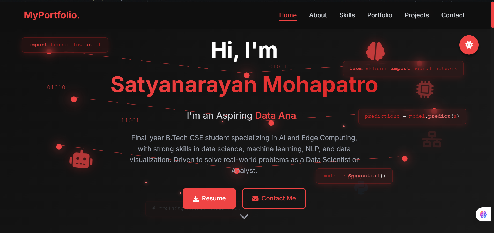
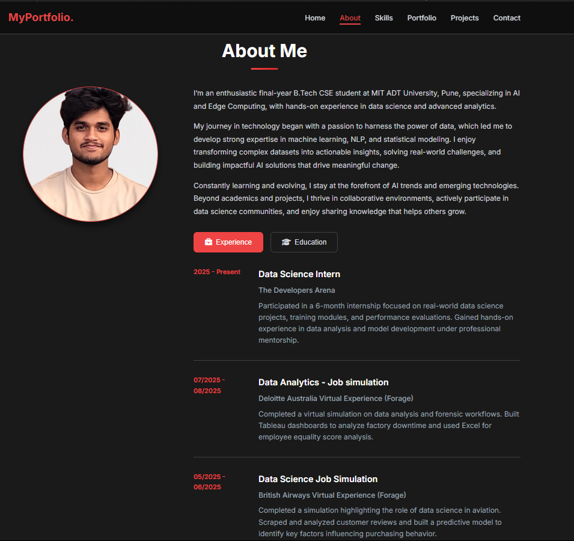
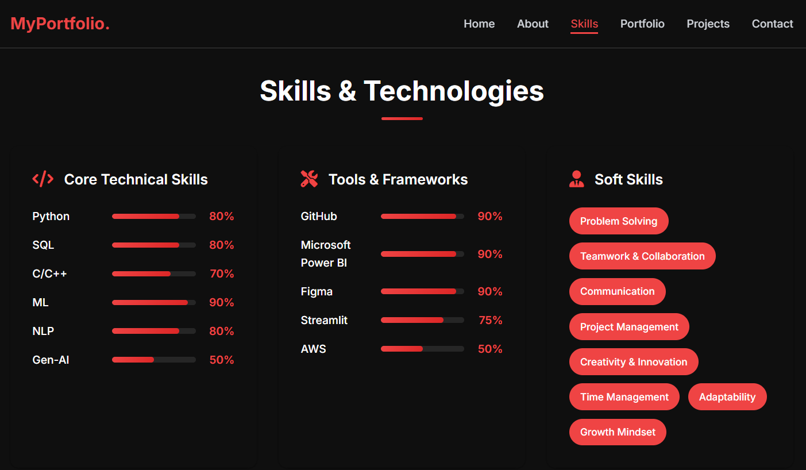
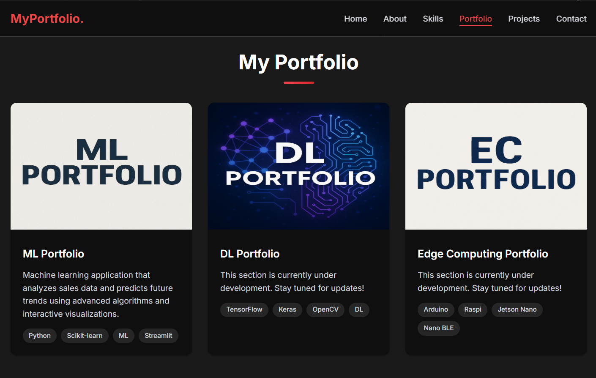

#  Personal Portfolio Website

A sleek and responsive personal portfolio website built using **HTML**, **CSS**, and **JavaScript**, showcasing my skills, projects, and achievements in **Computer Science** and **Artificial Intelligence**.

>  Designed to highlight my journey in Machine Learning, AI, and real-world problem-solving. Explore my featured projects and feel free to connect for collaboration or opportunities!

---

##  Live Preview

🔗 [View Portfolio Live](https://satyaaportfolio.netlify.app/)  

---

##  Features

- Responsive and mobile-friendly layout  
- Clean, modern UI inspired by `satyaa-portfolio.netlify.app`  
- Typewriter animation in hero section  
- Interactive tabbed About Me section (Experience & Education)  
- Project and Portfolio cards with GitHub & Live Demo links  
- Skills, Timeline, and Contact Form  
- Scroll-triggered animations  
- Dark/Light mode 

---

##  Tech Stack

- HTML5  
- CSS3  
- JavaScript (Vanilla)  
- Font Awesome (for icons)  
- AOS (Animate on Scroll)  
- Google Fonts  
- Media Queries for responsiveness

---

##  Website Sections

- **Navbar** – Sticky nav with smooth scrolling  
- **Hero** – Name, rotating tagline, call-to-action buttons  
- **About Me** – Bio + Interactive tabs (Experience / Education)  
- **Skills** – Programming, Tools, Soft Skills  
- **Portfolio** – ML, DL, and EC projects (3 cards)  
- **Projects** – Additional individual projects (3 cards)  
- **Experience** – Job titles, roles, timelines  
- **Education** – Degrees and certifications  
- **Contact** – Google Form integration and social links  

---

##  Screenshots

### 🔹 Home + Hero Section  

### 🔹 About Me + Tabs  

### 🔹 Skills Section  

### 🔹 Portfolio Section  

